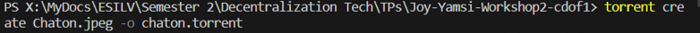
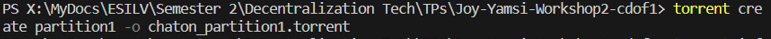
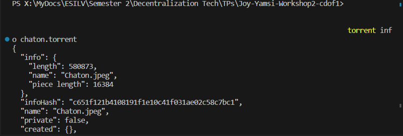
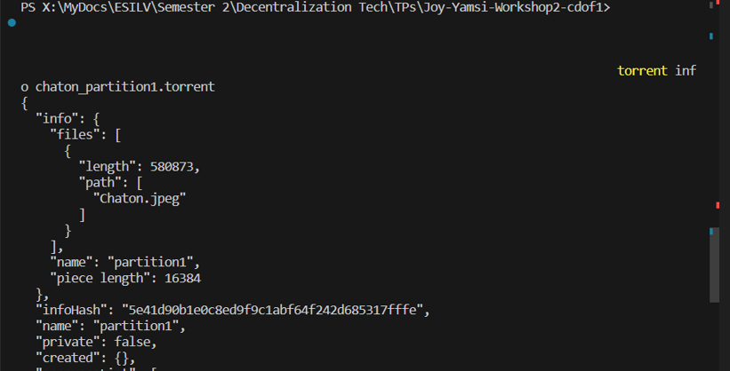
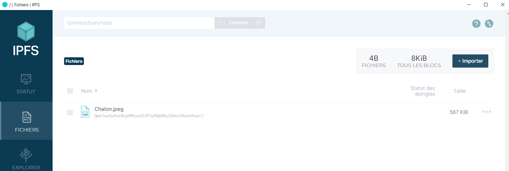
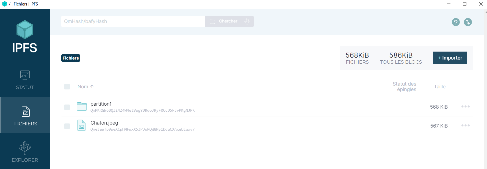
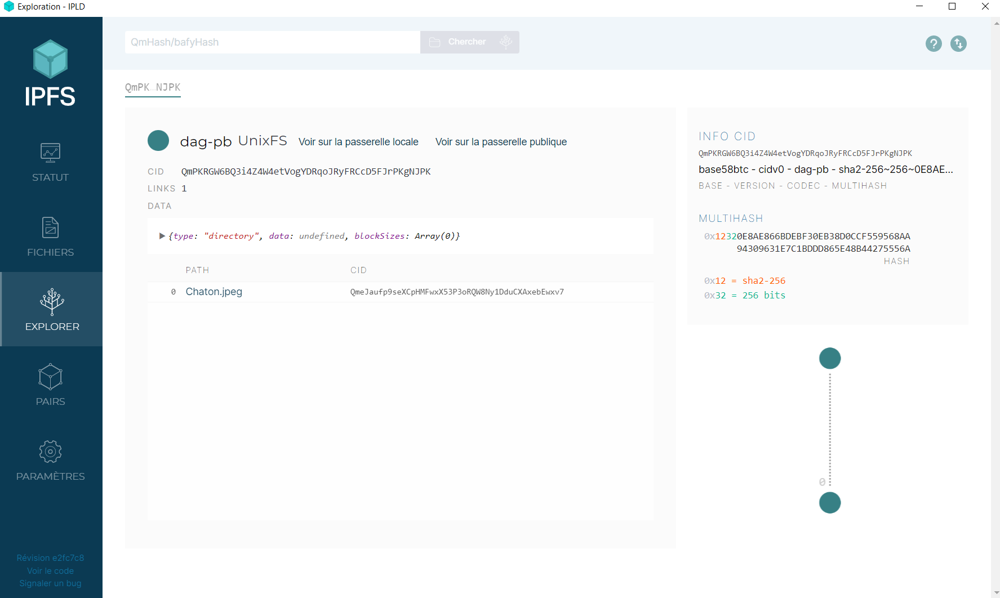
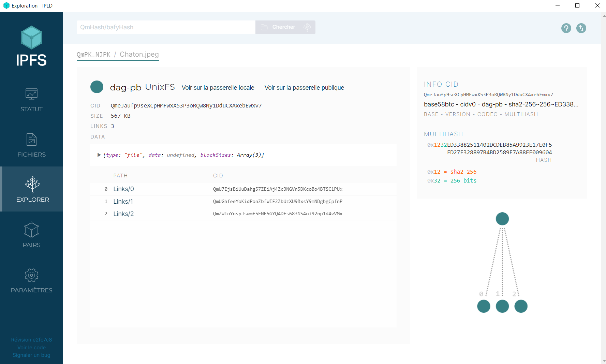
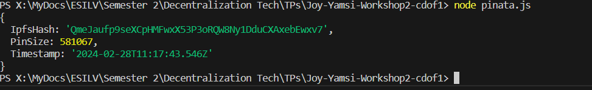

Student Name : Joy Yamsi

This files contains answer to questions in the README.

# TORRENT  
Q1 - Create a torrent containing this image
We create the chaton.torrent file.
torrent create Chaton.jpeg -o chaton.torrent




Q2 - Now copy the image to a new directory named partition1 and create a torrent of this folder. What do you observe?
move Chaton.jpeg partition1
torrent create partition1 -o chaton_partition1.torrent





We use the following command to access a torrent info : 
torrent info <nom_fichier>

We observe that this torrent contains info about the folder structure as well as about the image. 
We can say that when a we make a torrent of a folder, thsi torrent will contain info about itself and all the files and subfolders in it.


Q3 - Copy the partition1 folder and then generate the associated torrent. What do you observe?
 
torrent create partition1_copy -o partition2.torrent

The torrent is the same as the one created above with just the folder name changed.

# IPFS
Q1 - Upload the previous image to IPFS.



Q2 - Now upload partition1 to IPFS. What do you observe compared to the torrent part?





The folder(and its contents) has a unique hash and the content structure id preserved.

Q3 - Copy the partition1 folder and then generate the associated torrent. What do you observe?


# Upload files on IPFS using Pinata
We generate the API Key, copy the provided code, modify the file path and run the script.




# Leverage P2P to create a website hosted decentralizely.
We use Pinata's service to create a github Actions workflow which automates updates on files on IPFS.


```


